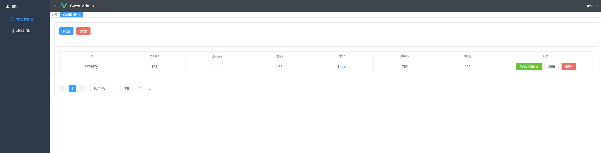

# RustDesk API

This project implements RustDesk's API using Go and includes a Web UI and Web client. RustDesk is a remote desktop software that provides a self-hosting solution.

<div align=center>


</div>

## Preparation

### [Rustdesk](https://github.com/rustdesk/rustdesk)

1. The PC client version used is ***1.3.0***, and versions ***1.2.6+*** have been tested to work.
2. The server must specify a key and not use the built-in generated key; otherwise, connection issues or timeouts may occur.

```bash
hbbs -r <relay-server-ip[:port]> -k 123456789
hbbr -k 123456789
```

## Features

### **API Service**: Implements the basic interfaces for the PC client.


### **Web UI**: Uses a front-end and back-end separation, providing a user-friendly management interface primarily for administration and display.

***The front-end code is available at [rustdesk-api-web](https://github.com/lejianwen/rustdesk-api-web).***

***The admin panel can be accessed at `http://<your server>:21114/_admin/` with default credentials of `admin admin`. Please change the password promptly.***

1. Admin interface  
   
2. Regular user interface  
   
3. Password can be changed from the top-right corner  
   
4. Groups can be customized for easier management. Two types of groups are currently supported: `Shared Group` and `Regular Group`.  
   

### **Web Client**:

1. If you are already logged in to the admin panel, the web client will automatically log in.
2. If not logged in, click the login button in the top-right corner; the API server will be auto-configured.
3. Once logged into the admin panel, the address book will be saved automatically in the web client for convenience.  
   

### **Automated Documentation**: API documentation is generated using Swag, making it easier for developers to understand and use the API.

1. Admin documentation: `<your server>/admin/swagger/index.html`
2. PC client documentation: `<your server>/swagger/index.html`  
   

## Installation and Running

### Configuration

* Refer to the `conf/config.yaml` file to modify relevant configurations. If `gorm.type` is `sqlite`, MySQL configurations are not required.

```yaml
gin:
  api-addr: "0.0.0.0:21114"
  mode: "release"
  resources-path: 'resources'
gorm:
  type: "sqlite"
  max-idle-conns: 10
  max-open-conns: 100
mysql:
  username: "root"
  password: "111111"
  addr: "192.168.1.66:3308"
  dbname: "rustdesk"
rustdesk:
  id-server: "192.168.1.66:21116"
  relay-server: "192.168.1.66:21117"
  api-server: "http://192.168.1.66:21114"
  key: "123456789"
```

### Installation Steps

#### Running with Docker

1. Run directly using Docker:

```bash
docker run -d --name rustdesk-api -p 21114:21114 -v /data/rustdesk/api:/app/data lejianwen/rustdesk-api
```

- Environment variables with the prefix `RUSTDESK_API` can be set.

| Variable Name                         | Description                                      | Example                      |
|----------------------------------------|--------------------------------------------------|------------------------------|
| -----------GORM Configuration----------| -------------------------------------------------| -----------------------------|
| RUSTDESK_API_GORM_TYPE                | Database type, either `sqlite` or `mysql`. Default is `sqlite` | sqlite                       |
| RUSTDESK_API_GORM_MAX_IDLE_CONNS      | Maximum number of idle connections                | 10                           |
| RUSTDESK_API_GORM_MAX_OPEN_CONNS      | Maximum number of open connections                | 100                          |
| -----------MySQL Configuration---------| ---Not required if using `sqlite`---              |                              |
| RUSTDESK_API_MYSQL_USERNAME           | MySQL username                                   | root                         |
| RUSTDESK_API_MYSQL_PASSWORD           | MySQL password                                   | 111111                       |
| RUSTDESK_API_MYSQL_ADDR               | MySQL address                                    | 192.168.1.66:3306            |
| RUSTDESK_API_MYSQL_DBNAME             | MySQL database name                              | rustdesk                     |
| -----------Rustdesk Configuration------| -------------------------------------------------| -----------------------------|
| RUSTDESK_API_RUSTDESK_ID_SERVER       | Rustdesk ID server address                       | 192.168.1.66:21116           |
| RUSTDESK_API_RUSTDESK_RELAY_SERVER    | Rustdesk relay server address                    | 192.168.1.66:21117           |
| RUSTDESK_API_RUSTDESK_API_SERVER      | Rustdesk API server address                      | http://192.168.1.66:21114    |
| RUSTDESK_API_RUSTDESK_KEY             | Rustdesk key                                     | 123456789                    |

2. Use `docker-compose`, adding your RustDesk API configuration to the provided RustDesk example:

```docker-compose
networks:
  rustdesk-net:
    external: false
services:
  hbbs:
    container_name: hbbs
    ports:
      - 21115:21115
      - 21116:21116 # Custom hbbs port mapping
      - 21116:21116/udp # Custom hbbs port mapping
      - 21118:21118 # Required for web client
    image: rustdesk/rustdesk-server
    command: hbbs -r <relay-server-ip[:port]> -k 123456789 # Use your domain or IP + hbbr exposed port
    volumes:
      - /data/rustdesk/hbbs:/root # Custom mount directory
    networks:
      - rustdesk-net
    depends_on:
      - hbbr
    restart: unless-stopped
    deploy:
      resources:
        limits:
          memory: 64M
  hbbr:
    container_name: hbbr
    ports:
      - 21117:21117 # Custom hbbr port mapping
    image: rustdesk/rustdesk-server
    command: hbbr -k 123456789
    volumes:
      - /data/rustdesk/hbbr:/root # Custom mount directory
    networks:
      - rustdesk-net
    restart: unless-stopped
    deploy:
      resources:
        limits:
          memory: 64M
  rustdesk-api:
    container_name: rustdesk-api
    ports:
      - 21114:21114
    image: lejianwen/rustdesk-api
    volumes:
      - /data/rustdesk/api:/app/data # Mount database for easy backups
    networks:
      - rustdesk-net
    restart: unless-stopped
```

#### Running from Release

Download the release from [release](https://github.com/lejianwen/rustdesk-api/releases).

#### Source Installation

1. Clone the repository:
   ```bash
   git clone https://github.com/lejianwen/rustdesk-api.git
   cd rustdesk-api
   ```

2. Install dependencies:

    ```bash
    go mod tidy
    # Install Swag if you need to generate documentation; otherwise, you can skip this step
    go install github.com/swaggo/swag/cmd/swag@latest
    ```

3. Build the admin front-end (the front-end code is in [rustdesk-api-web](https://github.com/lejianwen/rustdesk-api-web)):
   ```bash
   cd resources
   mkdir -p admin
   git clone https://github.com/lejianwen/rustdesk-api-web
   cd rustdesk-api-web
   npm install
   npm run build
   cp -ar dist/* ../admin/
   ```

4. Run:
    ```bash
    # Run directly
    go run cmd/apimain.go
    # Or generate and run the API using generate_api.go
    go generate generate_api.go
    ```

5. To compile, change to the project root directory. For Windows, run `build.bat`, and for Linux, run `build.sh`. After compiling, the corresponding executables will be generated in the `release` directory. Run the compiled executables directly.

6. Open your browser and visit `http://<your server>:21114/_admin/`, with default credentials `admin admin`. Please change the password promptly.

## Miscellaneous

- [Change client ID](https://github.com/abdullah-erturk/RustDesk-ID-Changer)
- [webclient](https://hub.docker.com/r/keyurbhole/flutter_web_desk)